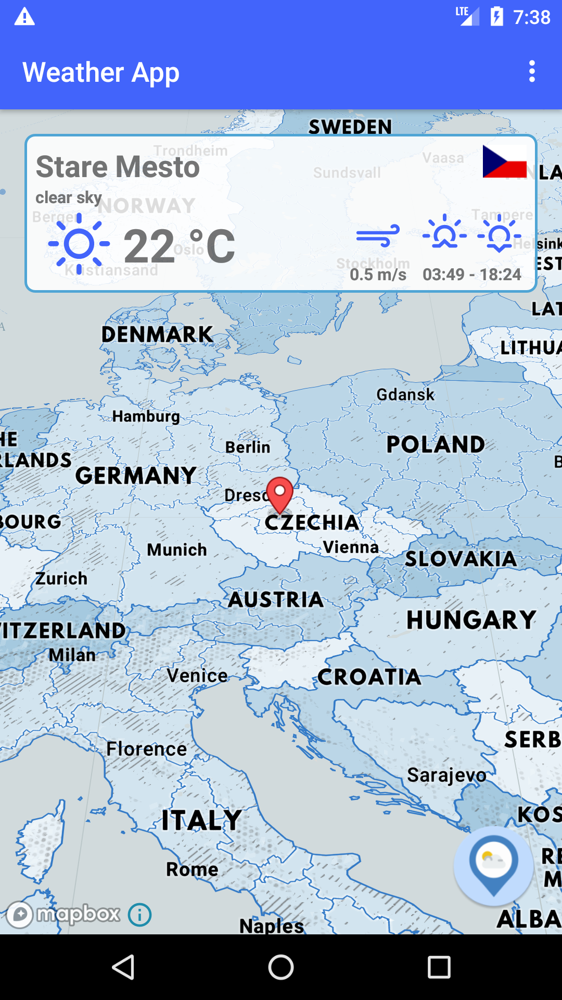
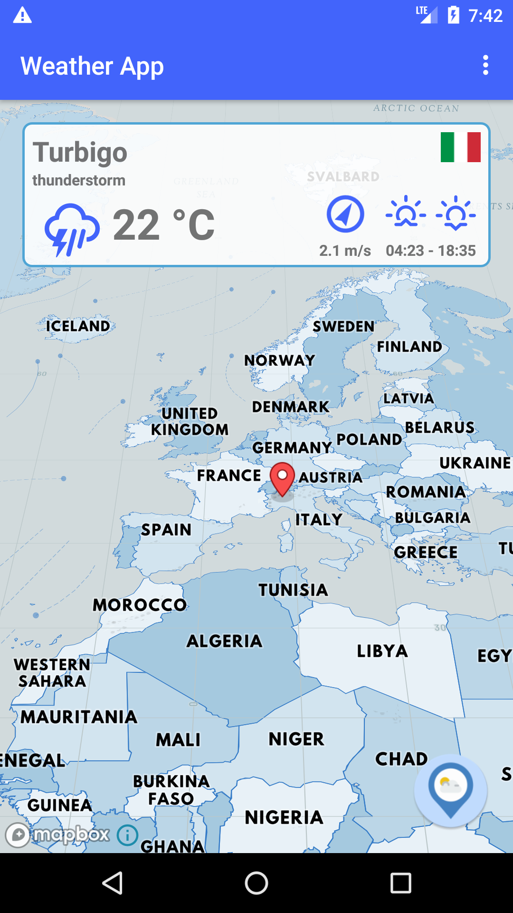
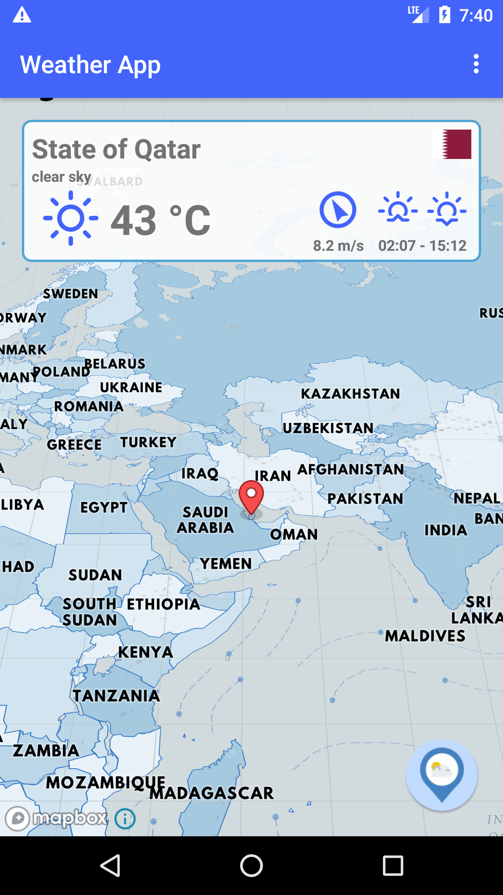

# Weather App



App available in [Google Play Store](https://play.google.com/store/apps/details?id=org.kuska.spaceti.weatherapp).

This repository contains the source code for the application.

You will need JDK 1.8+ installed to work with it.
Gradle, Android SDK and project dependencies will be downloaded automatically.

## Building the app

#### 1. Build the application using command line or using GUI.

To build a debug APK, run:

```
$ ./gradlew clean assembleDebug
```
  
This creates an APK named `app-debug.apk` in `project_name/module_name/build/outputs/apk/`. The file is already signed with the debug key and aligned with `zipalign`, so you can immediately install it on a device.

#### 2. Or to build the APK and immediately install it on a running emulator or connected device, instead invoke `installDebug`:

```
$ gradlew installDebug
```

To see all the build and install tasks available for each variant (including uninstall tasks), run the `tasks` task.

```
$ ./gradlew tasks
```

## Running unit tests

You can run tests targeting specific build variant using following syntax:

```
$ ./gradlew testVariantNameUnitTest
```

To run the tests targeting debug variant, run:

```
$ ./gradlew testDebugUnitTest
```
